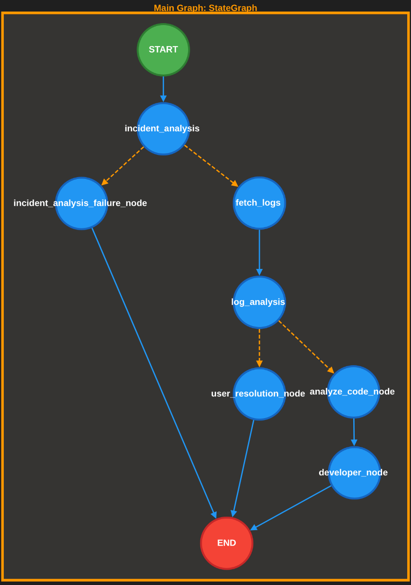

# Agentic AI — Multiagent analiza incidenata

**Predmet** | Primena veštačke inteligencije
**Student:** Pavle Gašić 2024/3804

---

## Opis sistema

Sistem implementira višeagentnu arhitekturu zasnovanu na velikim jezičkim modelima (LLM) koja je sposobna da automatski prima prijave incidenata, analizira logove aplikacije, pretražuje kod aplikacije i generiše izveštaje o uzroku greške i predlogu ispravke. Rešenje je implementirano kroz više specijalizovanih LLM agenata putem determinističkog grafa stanja (LangGraph `StateGraph`). Sistem je razvijen i evaluiran u kontekstu realne aplikacije za upravljanje fakturama dobavljača.

---

## 

## Arhitektura sistema

Sistem se sastoji od pet mikroservisa kontejnerizovanih putem Docker Compose-a, koji zajedno čine platformu za upravljanje fakturama i incidentima:

| Servis | Tehnologija | Port | Uloga u sistemu |
|---|---|---|---|
| `invoice-management-server` | Spring Boot + PostgreSQL | 8080 | Domen aplikacije: obrada faktura, validacija, kalkulacija zarada, upisivanje strukturiranih logova |
| `invoice-management-frontend` | React | 3000 | UI za Invoice management aplikaciju |
| `incident-management-server` | Spring Boot + PostgreSQL | 8081 | Platforma za upravljanje incidentima - prima prijave, okida agenta, prikazuje izveštaje |
| `incident-management-frontend` | React | 3001 | Korisnički interfejs za prijavu i praćenje incidenata |
| `incident-agent` | Python + FastAPI | 8000 | AI agent za analizu incidenata |

Agent ne pristupa bazi podataka direktno već isključivo putem REST API-ja i strukturiranih logova, što simulira realnu situaciju u kojoj agent ima ograničen uvid u sistem koji analizira.

---

## Incident Agent

### Pregled

FastAPI servis koji prosleđuje novokreirani incident agentu na analizu. Agent je implementiran koristeći LangGraph framework u obliku determinističkog grafa stanja.

## Graf izvršavanja

Agent funkcioniše kao usmereni aciklični graf (DAG) sa uslovnim grananjem. Graf se kompajlira jednom pri pokretanju servisa i ponovo koristi za svaki dolazni incident.



Graf implementira tri puta razrešenja:
- **Nevalidan unos/nedovoljno podataka** - ako je korisnik u naslovu i opisu incidenta uneo podatke koji nisu dovoljni za analizu problema ili nisu povezani sa kontekstom agenta, dalji tok se prekida, a generiše se odgovarajući odgovor
- **Korisnički put (USER)** — incident je uzrokovan neispravnim unosom korisnika; agent generiše uputstvo za ispravku namenjeno krajnjem korisniku
- **Programerski put (DEVELOPER)** — incident je uzrokovan greškom u kodu; agent vrši analizu izvornog koda i generiše tehnički izveštaj namenjen razvojnom timu

---

## Deljeno stanje (IncidentState)

Celokupni tok izvršavanja operiše nad deljenim `IncidentState` objektom koji se prosleđuje kroz svaki čvor grafa i postepeno popunjava kako analiza napreduje. Ovaj pristup obezbeđuje tipsku bezbednost i eksplicitnost podataka koji se razmenjuju između agenata.

```python
class IncidentState(TypedDict):
    # Ulaz
    incident_title: str
    incident_description: str

    # Faza 1: Analiza incidenta
    incident_analysis_status: Literal["SUCCESS", "FAILURE", "INSUFFICIENT_DATA"]
    business_context: Optional[str]
    start_time: Optional[datetime]
    end_time: Optional[datetime]

    # Faza 2: Preuzimanje i analiza logova
    logs: Optional[List[dict]]
    resolution_type: Literal["USER", "DEVELOPER"]
    confidence: Optional[float]
    responsible_components: Optional[list[str]]
    responsible_methods: Optional[list[str]]
    suggested_user_actions: Optional[str]

    # Faza 3: Analiza koda
    error_type: Optional[str]
    fix_suggestion: Optional[str]
    code_analysis_reasoning: Optional[str]

    # Izlaz
    final_report: Optional[str]
    final_report_visibility: Optional[str]
```

---

## Agenti

### 1. IncidentAnalysisAgent

Predstavlja prvu fazu obrade prispelog incidenta.  Vrši ekstrakciju strukturiranih informacija iz opisa incidenta koji je dat u slobodnom obliku. Agent je fokusiran na to kada se akcija u incidentu dogodila kao i koji delovi sistema su odgovorni za grešku.

**Ulaz:** Naslov incidenta + opis

**Izlaz:**
```python
class IncidentAnalysisResult(BaseModel):
    business_context: Optional[str]
    start_time: Optional[datetime]
    end_time: Optional[datetime]
    incident_analysis_status: Literal["SUCCESS", "FAILURE", "INSUFFICIENT_DATA"]
```

**Ključna ponašanja definisana prompt inžinjeringom:**
- Ekstrahuje poslovne informacije (`file`, `invoice`, `batchUploadId`, `vendor`) isključivo ako su eksplicitno navedeni u tekstu incidenta
- Konvertuje vremenske okvire (`"danas"`, `"juče"`, `"između X i Y"`) u struktuirane okvire
- Klasifikacija: `SUCCESS` (dovoljno podataka za nastavak), `INSUFFICIENT_DATA` (razumljiv incident bez akcionih identifikatora), `FAILURE` (besmislen ili van domenski unos)

---

### 2. LogAnalysisAgent

Klasifikacija incidenta na osnovu preuzetih logova i određivanje daljeg toka izvršavanja — USER ili DEVELOPER.

**Ulaz:** Lista log rekorda koji sadrže `level`, `message`, `module`, `stackTrace`, `timestamp`, preuzeta iz invoice backend-a filtriranjem po poslovnom kontekstu i vremenskom opsegu iz prethodne faze.

**Izlaz:**
```python
class LogAnalysisResult(BaseModel):
    resolution_type: Literal["USER", "DEVELOPER"]
    confidence: float
    suggested_user_actions: Optional[str]
    responsible_components: Optional[list[str]]
    responsible_methods: Optional[list[str]]
```

**Logika klasifikacije definisana u promptu:**
- `USER` — greške parsiranja, neispravan CSV format, nedostajuća polja, neispravni ulazni podaci
- `DEVELOPER` — izuzeci u izvršavanju, NullPointerException, greške vezane za bazu podataka, pogrešne kalkulacije, nepoznat uzrok

Polja `responsible_components` i `responsible_methods`, kada su dostupni u stack trace-ovima, prosleđuju se kao ulazni nagoveštaji CodeAgentu i koriste se za sužavanje pretrage u vektorskoj bazi.

---

### 3. CodeAgent

CodeAgent je centralni deo ovog rada. Koristi se za analizu uzroka grešaka u backend kodu, zasnovanu na ReAct paradigmi.

#### Teorijska osnova — ReAct paradigma

ReAct (Reasoning + Acting) je paradigma za izgradnju autonomnih agenata u kojoj LLM naizmenično generiše verbalizovane korake zaključivanja (*Thought*) i akcije (*Action*) u obliku poziva alata, pri čemu rezultati alata (*Observation*) bivaju vraćeni modelu kao deo konteksta za sledeći korak. Ova petlja se nastavlja dok agent ne proceni da ima dovoljno informacija za finalni odgovor.

#### Arhitektura

Agent operira u dve jasno odvojene faze: iterativno prikupljanje konteksta i kreiranje struktuiranog outputa

**Faza 1 — Iterativno prikupljanje konteksta**

U prvoj fazi agent prikuplja podatke koristeći dva tool-a: code tool i business knowledge tool. Ideja je da kroz više iteracija može da pretražuje source code dok sa druge strane može dobiti i informacije o biznis domenu kao bi efikasnije klasifikovao probleme u kodu.

Limit za broj iteracija je `MAX_ITERATIONS = 5`. Budući da svaki LLM korak odlučivanja i svako izvršavanje tool-a troše jednu iteraciju, agent ima kapacitet za otprilike 4–5 poziva tool-a pre prekida.

**Faza 2 — Kreiranje struktuiranog outputa**

Nakon završetka prikupljanja konteksta, sve poruke se ekstrahuju iz istorije poruka i konkateniraju u jedinstven kontekstualni string. Ovaj kontekst, kombinovan sa originalnim logovima, prosleđuje se `llm.with_structured_output(CodeAnalysisResult)` radi determinističkog generisanja strukturiranog izlaza.

```python
# Faza 1: iterativno prikupljanje konteksta kroz ReAct petlju
agent_result = self.agent.invoke(
    {"messages": [HumanMessage(content=human_message)]},
    config={"recursion_limit": MAX_ITERATIONS},
)

# ekstrakcija svih odgovora alata iz istorije poruka
tool_context = "\n\n".join(
    msg.content
    for msg in agent_result["messages"]
    if isinstance(msg, ToolMessage)
)

# Faza 2: deterministička strukturirana sinteza nad agregiranim kontekstom
return self.structured_llm.invoke(final_prompt)
```

**Izlaz:**
```python
class CodeAnalysisResult(BaseModel):
    responsible_components: Optional[list[str]]  # Java klase odgovorne za grešku
    responsible_methods: Optional[list[str]]     # Java metode odgovorne za grešku
    error_types: Optional[list[str]]             # kategorija ili klasa izuzetka
    fix_suggestion: str                          # konkretan predlog ispravke
    reasoning: str                               # obrazloženje analize uzroka
```

---

## Alati (Tools)

U implementaciji koršćeni su search_code i business_knowledge tool-ovi.

### `search_code` — Semantička pretraga izvornog koda

Vrši pretragu semantičke sličnosti nad ChromaDB vektorskom bazom koja sadrži indeksirani Java izvorni kod invoice-management-server-a. Ključni alat za CodeAgent - omogućava agentu da pronađe relevantne delove koda opisom na prirodnom jeziku umesto eksplicitnim navođenjem putanje ili naziva.

```python
@tool("search_code")
def search_code(query: str, class_name: str = None) -> str
```

Parametar `class_name` omogućava filtriranje po metapodacima ChromaDB kolekcije, što značajno sužava prostor pretrage kada je sumnjičena klasa već poznata iz prethodne faze analize logova.

### `business_knowledge_tool` — Poslovni kontekst

Vraća kompletan sadržaj dokumenta sa poslovnim znanjem koji pokriva upravljanje dobavljačima, životni ciklus faktura, obradu batch upload-a, pravila kalkulacije zarada i uobičajene razloge odbijanja. Neophodan je u situacijama kada uzrok greške nije prost defekt u kodu već nesklad između implementacije i poslovnih pravila - na primer, pogrešne threshold vrednosti za bonuse.

```python
@tool("business_knowledge_tool")
def search_business_knowledge() -> str
```

---

## RAG nad izvornim kodom

Sposobnost semantičke pretrage koda oslanja se na RAG pipeline napravljen nad izvornim kodom invoice-management-server-a. Pipeline se sastoji od tri faze: parsiranje, indeksiranje i preuzimanje.

### Parsiranje izvornog koda

Nakon više iteracija definisanja kako čuvati kod u vektorskoj bazi zaključeno je da:
- nije moguće osloniti se na proizvoljno chunk-ovanje koda jer je na taj način nemoguće smisleno izdeliti kod
- pored čuvanja celih metoda potrebno je čuvati i metapodatke o poljima u klasi, imenu klase, imenu paketa...

Za parsiranje se koristi `tree-sitter-java` biblioteka. Kao jedinica za razdvajanje dokumenata koji će se čuvati u vektorskoj bazi uzeta je Java metoda, što ima smisla ako metode nisu preširoke i nije im delegirano previše odgovornosti.

```python
def extract_method(node, source: bytes, class_name: str) -> dict:
    # ekstrakcija identifikatora i formalnih parametara iz CST čvora
    method_source = source[node.start_byte:node.end_byte].decode()
    return {"class_name": ..., "method_name": ..., "parameters": ..., "source": method_source}
```

### Indeksiranje i embedding

Indekser (`app/rag/indexer.py`) konstruiše LangChain `Document` objekte od ekstrahovanih metoda i embed-uje ih koristeći `sentence-transformers/all-MiniLM-L6-v2` model. Model generiše 384-dimenzionalne vektore koji kodiraju semantičko značenje koda. Vektori se čuvaju u ChromaDB kolekciji zajedno sa metapodacima (`class_name`, `method_name`, `file_path`, `layer`).

Indeksiranje se izvršava jednom pri inicijalnom podizanju sistema (ili po izmeni izvornog koda) i nije deo putanje zahteva pri izvršavanju.

### Preuzimanje relevantnih isečaka

Retriever (`app/rag/retriever.py`) instancira embedding model i ChromaDB klijent jednom pri učitavanju modula, čime se izbegava trošak ponovne inicijalizacije pri svakom upitu.

```python
def get_relevant_code(query: str, class_name: str = None, k: int = 5) -> list[str]
```

---

## API

Agent izlaže jedan endpoint koji prima prijave incidenata:

```
POST /agent/process
Content-Type: application/json

{
  "incident_id": "abc-123",
  "title": "Greška u kalkulaciji zarada dobavljača",
  "description": "Zarade za dobavljača VEND-002 su netačne za današnji batch."
}
```

Obrada je u potpunosti asinhrona. Endpoint odmah vraća potvrdu prijema (`202 Accepted`) i pokreće celokupno izvršavanje grafa kao pozadinski `asyncio` zadatak. Ovo je neophodno jer izvršavanje grafa može trajati nekoliko sekundi zbog višestrukih LLM poziva i poziva alata. Finalni izveštaj se po završetku objavljuje na incident management server putem autentifikovanog REST poziva. Nivo vidljivosti izveštaja (`PUBLIC` ili `DEVELOPER_ONLY`) određuje se na osnovu tipa razrešenja.

---

## Pokretanje

```bash
# kopirati i popuniti promenljive okruženja
cp .env.example .env

# izgraditi i pokrenuti sve servise
docker compose up --build

# izgraditi RAG vektorsku bazu (jednom, ili nakon izmena Java koda)
docker exec incident-agent python -m app.rag.indexer
```

Servisi će biti dostupni na:
- Invoice UI: http://localhost:3000
- Incident UI: http://localhost:3001
- Incident Agent API: http://localhost:8000
